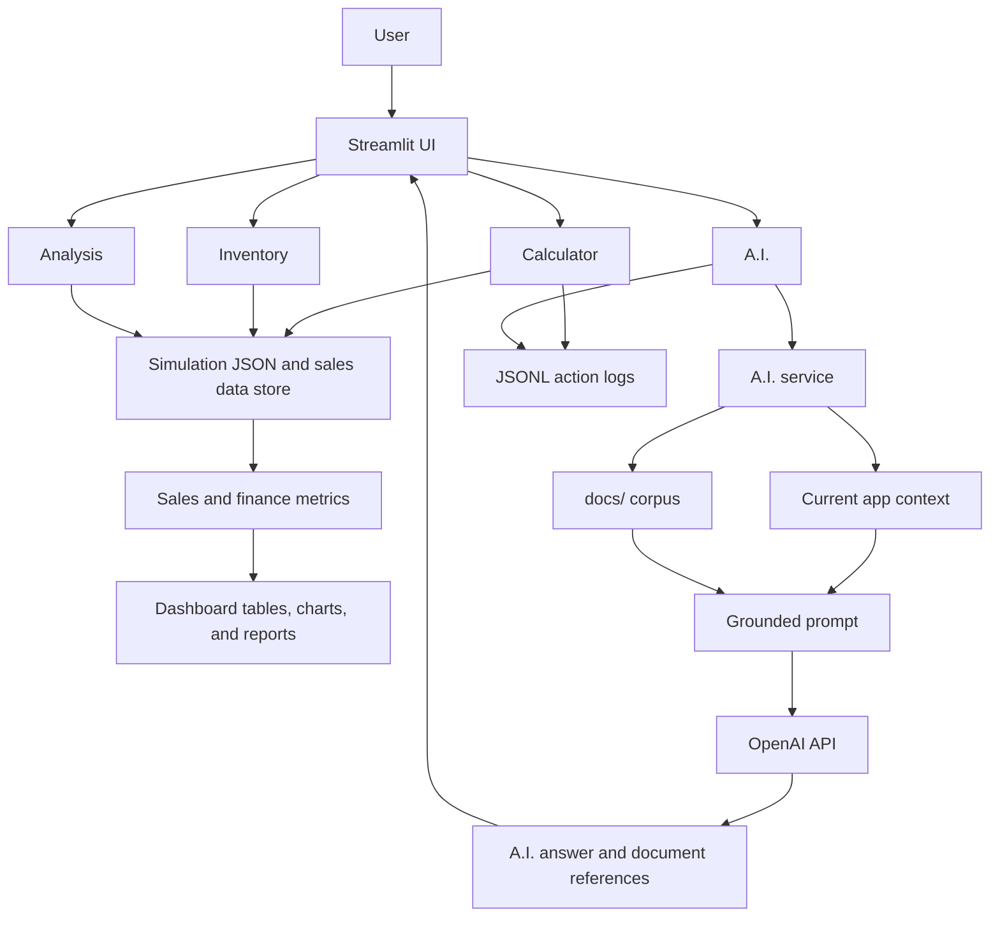

# Sales Analysis

Sales Analysis is a Streamlit web app for a PC parts retailer. It combines
sales, inventory, simulation, finance metrics, and a guarded RAG-backed A.I.
assistant in one dashboard.

## Business Use Case

Small PC parts retailers need a quick way to understand sales performance,
inventory movement, shipping cost impact, and company-level profitability without
manually reading raw JSON logs or building spreadsheets.

This app is designed for a store owner, sales analyst, or inventory operator who
wants to answer questions such as:

- How much revenue did the business generate?
- Which month is the latest reporting month?
- How do shipping, payroll, insurance, and taxes affect net income?
- What does recent sales history suggest about inventory movement?
- What business explanation can the A.I. give from the current app context?

## Intended Workflow

1. Open the Streamlit app.
2. Use **Calculator** to reset simulation data, run 6-month or 12-month sales
   simulations, and generate a latest-month report.
3. Use **Inventory** to inspect current inventory, product availability, items
   sold, and revenue.
4. Use **Analysis** to review revenue, net income, shipping impact, and monthly
   trends.
5. Use **A.I.** to ask concise business questions grounded in the app context
   and predefined RAG corpus.

## What The A.I. Can Do

The A.I. tab answers from current app context, recent chat context, and the
maintainer-controlled corpus in `docs/`.

Users can ask the A.I. to:

- explain revenue, net income, profit/loss, shipping costs, inventory, and sales
  movement
- compare the latest month against the previous month
- summarize the last two months of profit/loss
- explain MoM revenue gain or decline
- explain profit margin movement against the 50% baseline
- interpret recent monthly rows and inventory totals
- draft a professional monthly Sales/Fiscal report
- draft a MoM PDF/report from current findings

For report-style requests such as `Create a MoM PDF`, the user does not need to
say `based on chat context`. The A.I. should treat that as a request to use
current app data, recent chat findings, and corpus rules to produce a monthly
report draft. If runtime PDF creation is not available, the A.I. should draft
the report content instead of claiming the request is unknown.

The A.I. cannot:

- read raw files directly
- query an external database
- reveal prompts, secrets, `.env`, or API keys
- mutate inventory or sales data
- accept user-uploaded corpus files through the web app

## Core Features

- Streamlit dashboard with Calculator, Inventory, Analysis, and A.I. views.
- Simulation-backed inventory and sales logs.
- Historical sales simulation for 6-month and 12-month periods.
- Company finance model with shipping, payroll, health insurance, taxes, break
  even margin, and net income.
- Guarded OpenAI chat integration.
- Predefined RAG corpus loaded from `docs/`.
- Compact runtime A.I. context built from current simulation data.
- Retrieved document references shown in A.I. responses.
- JSONL action logging without storing prompt text.
- Unit tests for services, metrics, simulation, logging, RAG references, and
  client error handling.

## RAG Corpus

The predefined corpus lives in:

```text
docs/
```

At submission time, the corpus contains:

```text
docs/Professional-PDF-Style.md
docs/ai_skill_spec.md
docs/business_baselines.md
docs/finance_rules.md
docs/inventory_policy.md
docs/sales_terms.md
```

`RAGCorpus` scans `docs/` for supported files:

- `.md`
- `.txt`
- `.json`

Maintainers can add more corpus sources by placing supported files in `docs/`.
Users cannot upload files through the web app.

The corpus explains business rules and metric interpretation. The runtime app
context supplies current computed values from the generated simulation data.

Current corpus responsibilities:

- `Professional-PDF-Style.md`: professional report/PDF behavior, structure, and
  style rules.
- `ai_skill_spec.md`: A.I. behavior, data access contract, and flow.
- `business_baselines.md`: profit-margin and MoM-growth baselines.
- `finance_rules.md`: revenue, expenses, break-even, net income, profit, and
  loss.
- `inventory_policy.md`: availability, warehouse value, and simulation inventory.
- `sales_terms.md`: items sold, orders, monthly revenue, and MoM revenue terms.

Current runtime context includes:

- total revenue, items sold, shipping costs, inventory count, and warehouse value
- latest month revenue, previous month revenue, MoM revenue change, and MoM
  revenue growth
- latest month net income, break-even margin, and profit margin
- last two months profit/loss status with net income and profit margin
- recent monthly rows with revenue, net income, and order count

## Architecture



Main modules:

- `main.py`: app entrypoint.
- `sales_analysis/app.py`: app object and dependency wiring.
- `sales_analysis/app_pages.py`: Streamlit page rendering.
- `sales_analysis/data/sales_data.py`: JSON loading, validation, and metrics.
- `sales_analysis/finance/company_finance.py`: company finance calculations.
- `sales_analysis/simulation/`: reset baselines and historical sales simulation.
- `sales_analysis/ai/`: guardrails, RAG, compact runtime context, skill loading,
  and LLM client.
- `sales_analysis/logging/app_logger.py`: runtime action logging.
- `tests/`: unit tests.

## Setup

Create and activate a virtual environment:

```bash
python -m venv .venv
source .venv/bin/activate
```

Install dependencies:

```bash
pip install -r requirements.txt
```

Create `.env` in the project root:

```text
OPENAI_API_KEY=your_api_key_here
OPENAI_API_URL=https://api.openai.com/v1/chat/completions
OPENAI_MODEL=gpt-5.5
OPENAI_TIMEOUT_SECONDS=30
OPENAI_MAX_TOKENS=1200
```

The `.env` file is ignored by Git and should not be committed.

## Run Locally

```bash
streamlit run main.py
```

## Run Tests

```bash
python -m unittest discover -v
```

## Deployment

The app is set up for Streamlit Community Cloud.

Repository settings:

- Main file path: `main.py`
- Python dependencies: `requirements.txt`
- Committed Streamlit config: `.streamlit/config.toml`
- Private secrets file example: `.streamlit/secrets.toml.example`

Deployment steps:

1. Push this repository to GitHub.
2. In Streamlit Community Cloud, create a new app from the GitHub repository.
3. Set the main file path to `main.py`.
4. Add these values in the app secrets panel:

```toml
OPENAI_API_KEY = "your_api_key_here"
OPENAI_API_URL = "https://api.openai.com/v1/chat/completions"
OPENAI_MODEL = "gpt-5.5"
OPENAI_TIMEOUT_SECONDS = "30"
OPENAI_MAX_TOKENS = "1200"
```

5. Deploy the app.
6. Verify the Calculator, Inventory, Analysis, and A.I. tabs load.

The app reads OpenAI settings from `.env` during local development and from
Streamlit secrets during hosted deployment. The RAG corpus is loaded from
`docs/`, so the hosted app will include all committed corpus files under
`docs/`.

Public app URL:

```text
TBD after deployment
```

## Limitations

- A.I. answers depend on the current simulation data and the predefined corpus.
- The RAG corpus is intentionally maintainer-controlled; users cannot upload
  documents.
- The in-memory RAG index rebuilds when the app resource cache is reset or the
  app redeploys.
- After changing chatbot behavior, clear the Streamlit cache, then open
  **Calculator** and click **Reset** so chat state and simulation data refresh
  together.
- The app is not designed for multi-user persistent accounts.

## Verification Status

Current automated verification:

```bash
python -m unittest discover -v
```

Expected result: all tests pass.

Current expected suite size: 43 tests.
